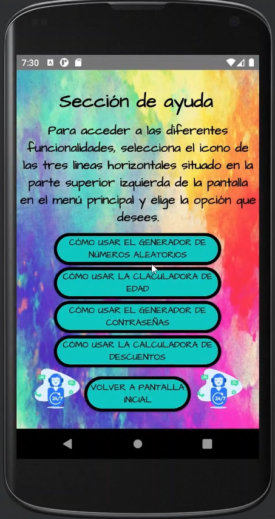
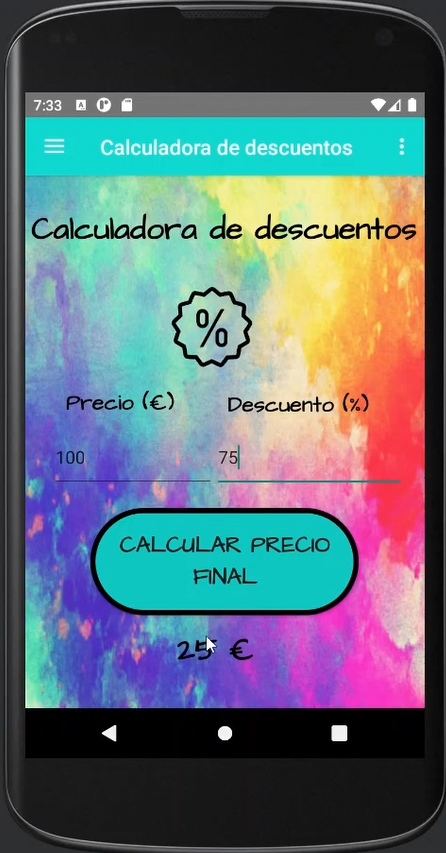
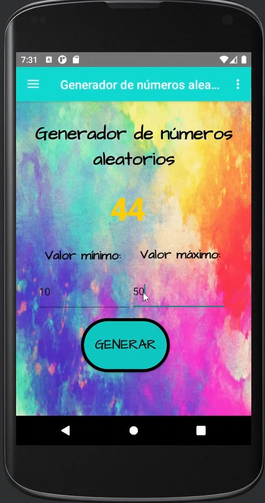

# TODO EN UNO

## Descripción de la aplicación

“Todo en uno” es una aplicación sencilla desarrollada en Android Studio que reúne diversas funcionalidades útiles en una sola interfaz. Su objetivo es facilitar tareas cotidianas de manera eficiente, con herramientas fáciles de usar y accesibles desde una sola app.

Las funcionalidades principales de la aplicación son:

- Generador de números aleatorios.
- Generador de contraseñas.
- Calculadora de edad.
- Calculadora de descuentos.

Esta aplicación está pensada para ser extensible, permitiendo agregar más herramientas con el tiempo.

## Pantallas de la aplicación

### Home
La pantalla principal es un acceso directo a las funcionalidades disponibles. Aquí se muestra una animación inicial y el nombre de la app. El usuario puede navegar a las diferentes herramientas a través de un **Navigation Drawer**, que aparece al hacer clic en las tres líneas horizontales en la esquina superior izquierda.

### Pantalla de ayuda
Desde el menú de tres puntos en la esquina superior derecha, el usuario puede acceder a la pantalla de ayuda. Esta pantalla explica el funcionamiento de las herramientas y proporciona botones para acceder rápidamente a cada una de las funcionalidades.

### Generador de números aleatorios
Permite generar un número aleatorio entre dos valores ingresados por el usuario (mínimo y máximo). El mínimo debe ser menor que el máximo para generar un número dentro del rango.

### Generador de contraseñas
Esta funcionalidad permite crear contraseñas seguras con opciones personalizables. El usuario puede definir la longitud de la contraseña y los tipos de caracteres a usar (mayúsculas, minúsculas, números, símbolos). Al presionar el botón de "Generar", se crea una contraseña aleatoria.

### Calculadora de edad
Permite calcular la edad de una persona en función de su fecha de nacimiento. Si el usuario ingresa una fecha de nacimiento futura, la app muestra un mensaje indicando que la persona aún no ha nacido.

### Calculadora de descuentos
Permite calcular el precio final después de aplicar un descuento. El usuario introduce el precio original y el porcentaje de descuento, y la app muestra el precio con el descuento aplicado.

## Requisitos

- **Android Studio**: Para abrir y ejecutar el proyecto.
- **Emulador o Dispositivo Android**: Para probar la aplicación en un dispositivo físico o virtual.

# Instalación

1. Clona el repositorio:
   ```bash
   git clone https://github.com/a-sisla/TodoEnUno.git
   
2. Abre el proyecto en Android Studio.

3. Asegúrate de tener configurado un dispositivo o un emulador para probar la aplicación.

4. Ejecuta la aplicación en el emulador o dispositivo Android.

# Autor

https://github.com/a-martinma

# Imágenes

<div style="display: flex; gap: 20px;">
  
  
  
  
  
</div>
